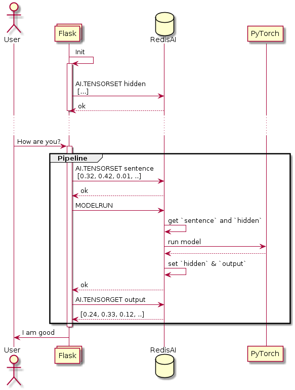

# ChatBot Demo
An example that showcases the benefit of running AI inside Redis

This repository contains the backend web app built with Flask, front end built with Angular (compiled to native JS) and the model files required for the chatbot to work. Follow below steps to bring the chatbot up.

## Architecture
When the flask application starts, [it will set an initial](https://github.com/RedisAI/ChatBotDemo/blob/master/redis_db.py#L23) `hidden` tensor.  This `hidden` tensor represents the intermediate state of the conversation.  On each new message received, an `sentence` tensor and the `hidden` tensor are passed through the model, which in turn produces an `output` and overrides the `hidden` tensor with the new intermediate state.


(Note this diagram is simplified, the full flow can be followed [here](https://github.com/RedisAI/ChatBotDemo/blob/master/redis_db.py)

## Requirements
Docker, Docker-compose

## Running the demo

```
$ git clone git@github.com:RedisAI/ChatBotDemo.git
$ cd ChatBotDemo
$ docker-compose up
```

### API
Try out the API (we have only one API endpoint -> `/chat` which accepts `message` as the json key with your message as value) using `curl` like given below.

```
curl http://localhost:5000/chat -H "Content-Type: application/json" -d '{"message": "I am crazy"}'
```

### CLI
Open a second terminal and inspect the keys

```
$ redis-cli
127.0.0.1:6379> keys *
1) "d_output"
2) "decoder"
3) "hidden"
4) "encoder"
5) "e_output"
6) "d_input"
7) "sentence"
127.0.0.1:6379> type hidden
AI_TENSOR
```

### UI
Open a browser and point it to `http://localhost:5000`.


